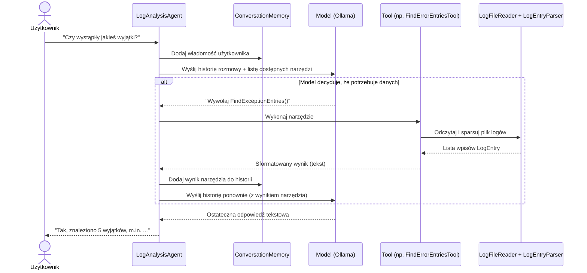

# LogAgentDemo

Edukacyjna aplikacja konsolowa w **.NET 9 / C#**, która pokazuje **jak działa Agent AI od podstaw** —
bez żadnego frameworka agentowego (Semantic Kernel, LangChain, CrewAI itp.). Agent analizuje plik
logów aplikacji i odpowiada na pytania użytkownika, samodzielnie decydując, z jakich narzędzi
(Tools) skorzystać, aby udzielić rzetelnej odpowiedzi.

Model językowy działa **w 100% lokalnie**, przy użyciu [Ollamy](https://ollama.com/).

## Czym jest Agent AI?

**Zwykłe wywołanie LLM** to jedna interakcja: wysyłasz pytanie, model generuje tekst na podstawie
tego, co "wie" ze swojego treningu, i na tym koniec. Model nie ma dostępu do Twoich danych (np.
plików logów) i nie może wykonać żadnej akcji — może tylko przewidywać kolejne słowa.

**Agent AI** to coś więcej niż pojedyncze zapytanie do modelu. To **pętla**, w której:

1. Model dostaje pytanie użytkownika **oraz listę dostępnych narzędzi** (funkcji, które może poprosić
   o wykonanie).
2. Model **decyduje**, czy do udzielenia odpowiedzi potrzebuje danych z narzędzia, a jeśli tak — którego.
3. Aplikacja (nie model!) **faktycznie wykonuje** to narzędzie — np. czyta plik z dysku.
4. Wynik narzędzia wraca do modelu jako część rozmowy.
5. Model widzi wynik i albo prosi o kolejne narzędzie, albo formułuje **ostateczną odpowiedź** opartą
   na prawdziwych danych, a nie na zgadywaniu.

Ten cykl (rozumowanie → działanie → obserwacja → rozumowanie...) bywa nazywany wzorcem **ReAct**
(*Reason + Act*). Kluczowa różnica względem "zwykłego LLM": agent może **sięgać po realne dane
i wykonywać akcje**, a nie tylko generować tekst na podstawie tego, co "pamięta" z treningu.

W tym projekcie cała ta pętla jest zaimplementowana **jawnie**, krok po kroku, w klasie
[`LogAnalysisAgent`](src/LogAgentDemo.App/Agents/LogAnalysisAgent.cs) — celowo bez użycia gotowych
mechanizmów auto-wywołania narzędzi, żeby dokładnie widzieć, co się dzieje na każdym etapie.

## Architektura

```
LogAgentDemo/
├── src/LogAgentDemo.App/
│   ├── Agents/            # Pętla decyzyjna agenta (serce projektu)
│   ├── Tools/              # Narzędzia, które agent może wywołać
│   ├── Services/           # Odczyt plików, parsowanie logów, pamięć rozmowy
│   ├── Models/             # Typowane dane domenowe (LogEntry, LogSeverity)
│   ├── Prompts/            # System prompt agenta
│   ├── Infrastructure/     # Konfiguracja (AgentOptions) i "okablowanie" DI
│   └── Program.cs          # Punkt wejścia - pętla rozmowy w konsoli
├── tests/LogAgentDemo.Tests/
└── logs/app.log            # Przykładowe dane wejściowe (~100 wpisów)
```

Każda klasa ma jedną, jasno określoną odpowiedzialność (SOLID / Single Responsibility):

| Klasa | Odpowiedzialność |
|---|---|
| `LogEntry`, `LogSeverity` | Typowany model pojedynczego wpisu logu. |
| `ILogFileReader` / `LogFileReader` | Jedyna klasa dotykająca dysku — czyta surowe linie pliku. |
| `ILogEntryParser` / `LogEntryParser` | Zamienia surowe linie tekstu na obiekty `LogEntry` (regex). |
| `IConversationMemory` / `ConversationMemory` | Przechowuje historię wiadomości (system/user/assistant/tool). |
| `ILogAgentTool` | Wspólny kontrakt narzędzia — zamienia metodę C# na `AIFunction`. |
| `ReadLogFileTool` | Narzędzie #1: surowy odczyt zawartości pliku logów. |
| `FindErrorEntriesTool` | Narzędzie #2: wyszukuje wpisy o poziomie `ERROR`. |
| `FindExceptionEntriesTool` | Narzędzie #3: wyszukuje wpisy zawierające wyjątki (np. `NullReferenceException`). |
| `SystemPrompts` | Instrukcja "systemowa" opisująca modelowi jego rolę i zasady korzystania z narzędzi. |
| `LogAnalysisAgent` | **Pętla decyzyjna** — wysyła wiadomości do modelu, wykonuje żądane narzędzia, zwraca wynik, powtarza aż do ostatecznej odpowiedzi. |
| `AgentOptions` | Konfiguracja: adres Ollamy, nazwa modelu, ścieżka do pliku logów. |
| `ServiceCollectionExtensions` | Rejestracja wszystkich powyższych klas w kontenerze DI. |

### Dlaczego agent wywołuje dane narzędzie?

Każde narzędzie to zwykła metoda C# opisana atrybutem `[Description]` (nazwa metody + opis + opisy
parametrów). `AIFunctionFactory.Create(...)` z `Microsoft.Extensions.AI` zamienia taką metodę
w `AIFunction` — strukturę, którą model językowy rozumie jako "dostępną funkcję". Model **nie
wykonuje kodu** — on tylko, na podstawie treści pytania i opisów narzędzi, prosi aplikację
o wywołanie konkretnej funkcji z konkretnymi argumentami (tzw. *function calling* / *tool calling*).
To `LogAnalysisAgent` faktycznie znajduje tę metodę po nazwie i ją uruchamia.

### Diagram przepływu



## Wymagania

- .NET SDK 9.0+
- [Ollama](https://ollama.com/download) uruchomiona lokalnie

## Instalacja Ollamy i pobranie modelu

1. Zainstaluj Ollamę ze strony [ollama.com/download](https://ollama.com/download) (Windows/macOS/Linux).
2. Uruchom serwer Ollamy (zwykle startuje automatycznie po instalacji; ręcznie: `ollama serve`).
3. Pobierz model użyty w tym projekcie:

   ```bash
   ollama pull qwen3:8b
   ```

   Możesz użyć innego modelu wspierającego *tool/function calling* (np. `llama3.1`, `qwen2.5`) —
   wystarczy zmienić wartość `ModelId` w `AgentOptions` (`src/LogAgentDemo.App/Infrastructure/AgentOptions.cs`).

4. Sprawdź, że Ollama odpowiada:

   ```bash
   ollama list
   ```

## Uruchomienie aplikacji

```bash
cd LogAgentDemo
dotnet run --project src/LogAgentDemo.App
```

Aplikacja czyta plik `logs/app.log` (ścieżka względna do katalogu roboczego — uruchamiaj z katalogu
`LogAgentDemo`, tak jak w przykładzie powyżej).

### Przykładowe pytania do agenta

- `Czy wystąpiły jakieś wyjątki?`
- `Jakie błędy pojawiały się najczęściej?`
- `Czy w logach widać problemy z bazą danych?`
- `Pokaż mi ostatnie 10 linii logów.`
- `Czy były jakieś problemy z logowaniem użytkowników?`
- `Dlaczego aplikacja zwróciła błąd 500?`

## Uruchomienie testów

```bash
dotnet test tests/LogAgentDemo.Tests
```

Testy obejmują: odczyt plików, parsowanie logów, działanie każdego narzędzia, pamięć rozmowy oraz
pętlę decyzyjną agenta (z zaskryptowanym, fałszywym modelem — bez potrzeby posiadania uruchomionej
Ollamy).
